# Alpha-Factor-Engine

A reproducible research pipeline for cross-sectional equity alpha. It tests whether simple
price-volume signals (short-term mean reversion, momentum, volatility) predict next-period returns
of S&P 500 stocks, and whether a Ridge-regression ensemble of them still makes money after
realistic trading costs on out-of-sample data.

Mostly, they do not. Five-day mean reversion has a small but reliable rank IC (0.016, Newey-West
t = 3.4, 2007-2019). After costs, the beta-neutral, dollar-neutral Ridge ensemble earned a net
Sharpe of 0.06 in the 2020-2025 test period (0.22 gross), with a market beta of +0.006 (t = 0.5).
Every table and figure is in [results/RESULTS.md](results/RESULTS.md), and
[results/Report.md](results/Report.md) gives a short written summary.

## Headline results (net of costs; test was evaluated once, after all choices were frozen)

| Strategy | Train Sharpe (2007-15) | Validation Sharpe (2016-19) | Test Sharpe (2020-25) |
|---|---:|---:|---:|
| Mean reversion (5d) | −0.23 | 0.07 | 0.25 |
| Momentum (120d, skip 5) | −0.28 | −0.27 | −0.17 |
| Low volatility (60d) | −0.01 | 0.17 | −0.14 |
| Ridge ensemble | −0.20 | −0.04 | 0.06 |
| Equal-weight composite | −0.26 | −0.13 | −0.22 |

## Tear sheet

The table below shows test-period performance (2020-2025, net of costs). Its rows come from
[`results/tables/summary/performance_full.md`](results/tables/summary/performance_full.md), which
holds every metric for every period; the same extract is in
[`portfolio_performance_test.md`](results/tables/summary/portfolio_performance_test.md).

| Strategy | Ann. return | Volatility | Sharpe | Sharpe (gross) | Max drawdown | IR vs SPY | IR vs EW composite | Turnover (x/yr) | Beta (SPY) |
|---|---:|---:|---:|---:|---:|---:|---:|---:|---:|
| Mean reversion | 1.57% | 6.39% | 0.25 | 0.43 | −15.8% | −0.69 | 0.36 | 19.8 | 0.03 |
| Momentum | −1.47% | 8.64% | −0.17 | −0.11 | −24.0% | −0.77 | 0.01 | 9.1 | −0.03 |
| Low volatility | −0.83% | 6.00% | −0.14 | −0.06 | −17.0% | −0.76 | 0.13 | 7.4 | −0.04 |
| Ridge ensemble | 0.40% | 6.28% | 0.06 | 0.22 | −14.7% | −0.73 | 0.95 | 16.5 | 0.01 |
| Equal-weight composite | −1.51% | 6.78% | −0.22 | −0.10 | −17.6% | −0.80 | n/a | 14.3 | −0.01 |

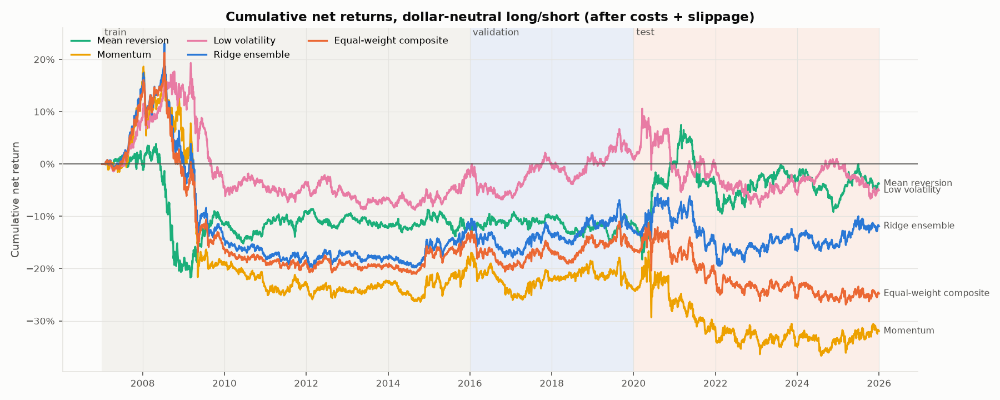

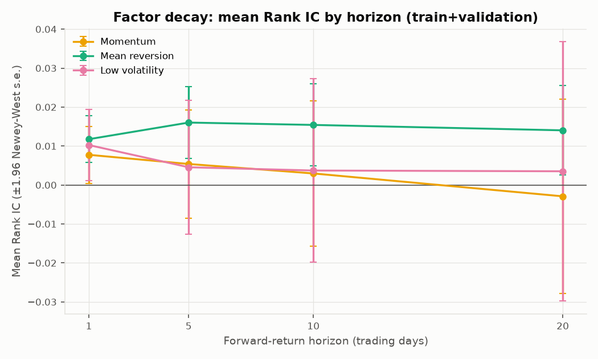

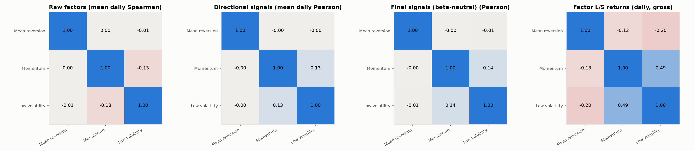

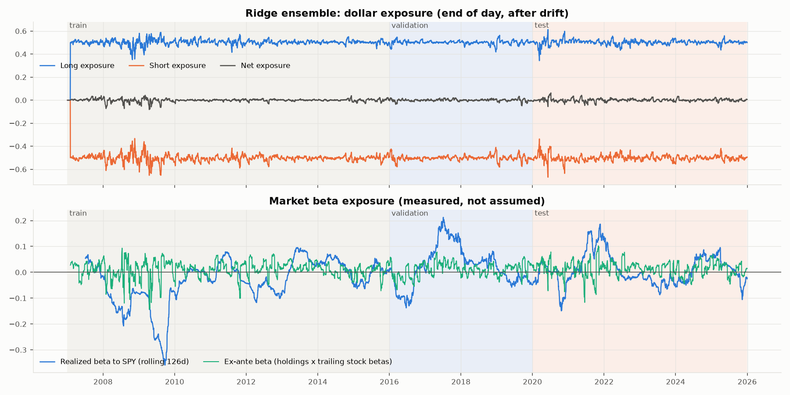

### Headline summary (Ridge ensemble, test 2020-2025)

| Metric | Measured |
|---|---|
| Annualized Sharpe | 0.06 net / 0.22 gross |
| Information Ratio | −0.73 vs SPY; 0.95 vs equal-weight composite (the second figure is the gain over a simple average of the signals) |
| Out-of-sample protocol | Chronological split, purged labels, test locked until config freeze |
| Market beta | +0.006, HAC t = 0.50 (explicit OLS on SPY) |
| Dollar neutrality | mean net exposure +0.0008, max abs 0.063 (drift between rebalances) |
| Execution costs | 3 bps slippage + 3 bps commission/spread per dollar traded, deducted from returns (≈1.0%/yr drag) |

This table is regenerated automatically as section 10 of `results/RESULTS.md`.

## Setup

```bash
python3 -m venv .venv
.venv/bin/pip install -r requirements.txt
```

Tested with Python 3.13, pandas 3.0, numpy 2.x, scikit-learn 1.7, statsmodels 0.14, yfinance 1.7.

## Reproduce

```bash
.venv/bin/python -m pytest -q                      # 54 unit tests
.venv/bin/python run_pipeline.py                   # train + validation only (test locked)
.venv/bin/python run_pipeline.py --run-test        # final out-of-sample evaluation (~1 min)
.venv/bin/jupyter nbconvert --to notebook --execute --inplace notebooks/*.ipynb   # re-run notebooks 01-05
```

The first run downloads data (about 5 minutes) and caches it in `data/raw/`; later runs read the
cache. All processing is deterministic (no random components; `seed: 42` is set for completeness).

## Data

| Item | Source | Notes |
|---|---|---|
| Daily OHLCV + Adj Close | Yahoo Finance via `yfinance`, 2006-01-01 to 2025-12-31 | 648 of 948 historical S&P 500 tickers available; cached to `data/raw/prices_yfinance.parquet` with a manifest listing missing tickers |
| Point-in-time S&P 500 membership | [`fja05680/sp500`](https://github.com/fja05680/sp500), pinned commit `a2430f2` | Used to trade a stock only while it is an index member |
| Benchmark | SPY adjusted close (total return) | Used for market beta and IR vs SPY |

Snapshot checksums from the reported run (SHA-256):
`prices_yfinance.parquet` `de1e2429594241b22b86cd07e4d4f7ad29dd809c1c185a496c026ee4e2c623d6`,
`sp500_membership.csv` `36326709d46d6cd25834de5df457b16f5f96fad3a06b9beac28f7b88aa0b0d54`.
Yahoo revises adjusted prices over time, so a fresh download may differ slightly. Keep the parquet
file to reproduce the reported numbers exactly.

Known data limitations:
- Survivorship bias: Yahoo lacks most delisted members. Index coverage rises from about 56% (2006)
  to 97% (2025).
- Ticker reuse is not checked.
- Prices are split-adjusted, so there is no minimum-price filter.

## Methodology and assumptions

All parameters live in [`config.yaml`](config.yaml).

| Step | Choice |
|---|---|
| Cleaning | Drop duplicate rows. Set non-positive prices to NaN. Treat a one-day move of more than ±75% as a bad print (NaN). No forward-filling. |
| Returns | Simple close-to-close returns from `adj_close`. `forward_return_h(t) = P(t+h)/P(t) − 1`, so `forward_return_1(t) = return(t+1)`. |
| Universe (date t) | Point-in-time member; valid price and volume > 0; 20-day median dollar volume ≥ $10M; ≥ 252 prior returns. |
| Factors (raw, through close t) | Reversal: past *w*-day return. Momentum: return from t−*w* to t−5. Volatility: annualized std of daily returns over *w* days. |
| Standardization | Per date, over the universe: winsorize 1%/99%, then z-score, then clip at ±3. |
| Direction | Reversal −1, momentum +1, volatility −1 (economic priors), so higher = more attractive. |
| Final signal | Directional z-score. In the chosen variant it is also residualized on trailing 252-day stock beta to SPY and re-standardized. |
| Lookback selection | Reversal {1, 5}, momentum {20, 60, 120}, volatility {20, 60}, chosen by validation mean Rank IC against the execution-aligned 5-day return. |
| Ridge ensemble | Inputs: the 3 final signals. Target: cross-sectionally rank-gaussianized 5-day return from t+1 to t+6. Alpha chosen by validation IC (ties go to the larger alpha). Fit on train for train/validation dates; refit on train + validation for test dates. |
| Splits | Train 2007-2015, validation 2016-2019, test 2020-2025. Every label is purged at period ends. |
| Portfolio | Long top 20% and short bottom 20%, equal-weighted; 0.5 long / 0.5 short (dollar neutral). Fewer than 5 names per leg means a flat book. |
| Design variants | Rebalance every {5, 10, 20} days × beta-neutral {no, yes}, chosen by validation net Sharpe. Chosen: 20 days, beta-neutral. |
| Execution | Signal at close t, trade at close t+1. Holdings drift between rebalances. |
| Costs | Per dollar traded, `turnover = Σ|w_target − w_drifted|`: 1 bp commission + 2 bps half-spread (transaction cost) + 3 bps slippage. `net = gross − transaction cost − slippage`. |
| Metrics | Annualization 252. Sharpe = mean/std·√252 of daily net returns, with no risk-free rate (self-financing long/short). IR = mean/std·√252 of (strategy − benchmark), against SPY and against the equal-weight composite. Beta from OLS on SPY with HAC errors. IC t-statistics are Newey-West. |

## Project structure

```text
Alpha-Factor-Engine/
├── config.yaml             # all research parameters
├── run_pipeline.py         # end-to-end pipeline
├── src/
│   ├── config.py           # config and output paths
│   ├── data.py             # download, membership, cleaning
│   ├── preprocessing.py    # returns, universe, z-scores
│   ├── factors.py          # reversal, momentum, volatility
│   ├── evaluation.py       # rank IC, decay, correlations
│   ├── models.py           # window selection, Ridge
│   ├── portfolio.py        # long/short weights, exposure
│   ├── backtest.py         # lag, drift, turnover, costs
│   ├── metrics.py          # Sharpe, IR, drawdown, beta
│   ├── extensions.py       # notebook 05 helpers
│   └── plots.py            # figures
├── tests/                  # 54 unit tests
├── notebooks/              # analysis notebooks 01-05
├── results/
│   ├── RESULTS.md          # generated results report
│   ├── Report.md           # written summary
│   ├── tables/
│   │   ├── summary/        # headline tables
│   │   └── diagnostics/    # supporting tables
│   └── figures/
│       ├── tearsheet/      # headline figures
│       └── diagnostics/    # supporting figures
└── data/                   # cached data (git-ignored)
```

## Look-ahead and leakage safeguards (tested)

- Factors, universe filters and stock betas use data through close t only. Tests perturb prices
  after t and assert that values at or before t do not change.
- Labels are purged: a label at t that uses prices up to t+h is dropped if t+h falls past the end
  of its period.
- Selection of lookbacks, the Ridge alpha and the design variant uses train and validation slices
  only. A test asserts that alpha selection is unchanged when test-period data is altered.
- Backtest: changing weights after signal date s does not change returns up to s + lag (tested).
- The test period is locked behind `--run-test`. The order in which decisions were made is
  recorded in the research timeline below.

## Research timeline

The order of research decisions matters when judging the out-of-sample result:

1. The first train/validation run, with the test period locked, used a fixed 5-day rebalance and
   dollar-neutral signals. Ensemble validation net Sharpe was −0.79, with about 66× annual
   turnover and a large negative market beta.
2. A design grid was then added, still before any test evaluation: rebalance every {5, 10, 20}
   days × beta-neutral {no, yes}, chosen by validation net Sharpe. The 20-day, beta-neutral
   variant was selected. All six variants are reported in `design_variant_selection`.
3. After a leakage review the configuration was frozen: reversal 5d, momentum 120d (skip 5),
   volatility 60d, beta-neutral, 20-day rebalance, Ridge alpha by validation IC, 3 + 3 bps costs
   and a 1-day execution lag.
4. The test period was evaluated once (`--run-test`). Running it needed one code fix, in the
   splice between the train-model and final-model composites, which changed no research decision.
5. A reporting-only fix purged the research-period IC robustness and by-year tables so that no
   label reaches into 2020. Selection had already been purged.
6. The notebook 05 extensions were defined after the test results had been seen. They are ranked
   on validation only and leave the frozen baseline unchanged.

## Portfolio-construction extensions (notebook 05)

Notebook 05 checks, after the fact, whether changes to portfolio construction can rescue the
frozen signal. It tries 5-day rebalancing, decile and ventile concentration, and a 10% entry /
20% exit turnover buffer. None of them beats the baseline after 6 bps costs: validation net Sharpe
is −0.04 for the baseline and between −0.43 and −0.10 for the variants. The buffer cuts turnover
by 23-37%, but still trades 2.5 to 3.5 times as much as the baseline. Details and the full
discussion are in [`notebooks/05_portfolio_optimization_extensions.ipynb`](notebooks/05_portfolio_optimization_extensions.ipynb).

## Limitations

The universe is affected by survivorship bias. There is no borrow cost, short rebate or
capacity/impact model. Costs are a flat bps per dollar traded. Only three factors are studied. The
design-variant grid was added after a first look at validation results (all variants reported).

## Appendix

<details>
<summary>Factor and risk diagnostics</summary>

### Summary tables (`results/tables/summary/`)

- [performance_full](results/tables/summary/performance_full.md): every metric, strategy and period
- [portfolio_performance_test](results/tables/summary/portfolio_performance_test.md)
- [in_sample_vs_out_of_sample_sharpe](results/tables/summary/in_sample_vs_out_of_sample_sharpe.md)
- [factor_summary_research](results/tables/summary/factor_summary_research.md)
- [factor_decay_research](results/tables/summary/factor_decay_research.md)
- [beta_and_neutrality](results/tables/summary/beta_and_neutrality.md)
- [ridge_coefficients](results/tables/summary/ridge_coefficients.md)

### Diagnostic tables (`results/tables/diagnostics/`)

| Area | Tables |
|---|---|
| Data | [data_quality](results/tables/diagnostics/data_quality.md), [cleaning_actions](results/tables/diagnostics/cleaning_actions.md), [universe_size_by_year](results/tables/diagnostics/universe_size_by_year.md) |
| Selection | [lookback_selection](results/tables/diagnostics/lookback_selection.md), [design_variant_selection](results/tables/diagnostics/design_variant_selection.md), [ridge_alpha_selection](results/tables/diagnostics/ridge_alpha_selection.md) |
| Factor IC | [ic_by_period_horizon](results/tables/diagnostics/ic_by_period_horizon.md), [ic_by_year_research](results/tables/diagnostics/ic_by_year_research.md), [ic_robustness_research](results/tables/diagnostics/ic_robustness_research.md), [factor_decay_icir_research](results/tables/diagnostics/factor_decay_icir_research.md), [signal_ic_execution_aligned](results/tables/diagnostics/signal_ic_execution_aligned.md) |
| Correlation | [factor_correlation_raw_spearman](results/tables/diagnostics/factor_correlation_raw_spearman.md), [signal_correlation_pearson](results/tables/diagnostics/signal_correlation_pearson.md), [final_signal_correlation_pearson](results/tables/diagnostics/final_signal_correlation_pearson.md), [factor_return_correlation](results/tables/diagnostics/factor_return_correlation.md) |
| Portfolio | [portfolio_performance_train](results/tables/diagnostics/portfolio_performance_train.md), [portfolio_performance_validation](results/tables/diagnostics/portfolio_performance_validation.md), [exposure_summary](results/tables/diagnostics/exposure_summary.md) |
| Sensitivity | [cost_sensitivity_validation_sharpe](results/tables/diagnostics/cost_sensitivity_validation_sharpe.md), [cost_sensitivity_test_sharpe](results/tables/diagnostics/cost_sensitivity_test_sharpe.md), [execution_lag_sensitivity_ensemble](results/tables/diagnostics/execution_lag_sensitivity_ensemble.md) |

### Diagnostic figures (`results/figures/`)

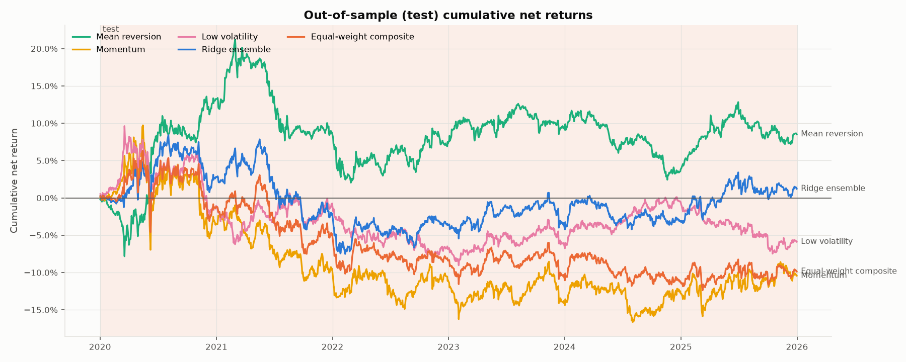

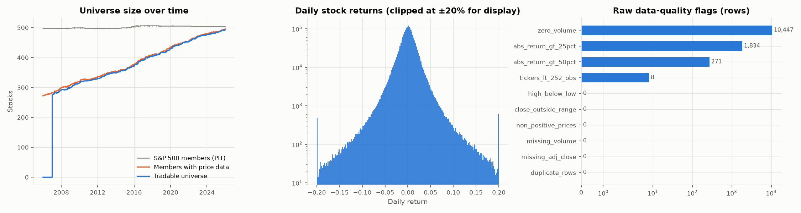

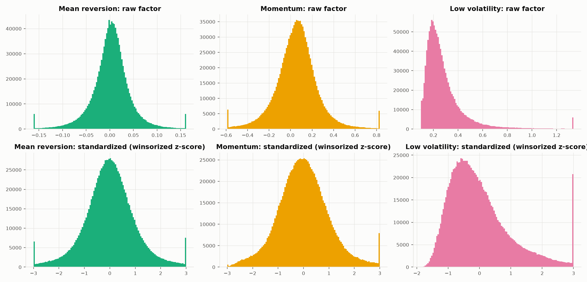

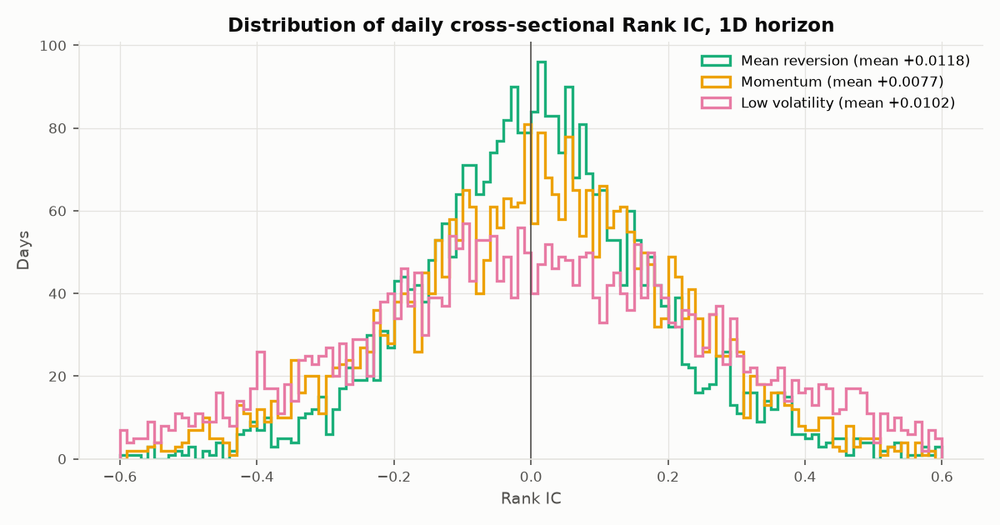

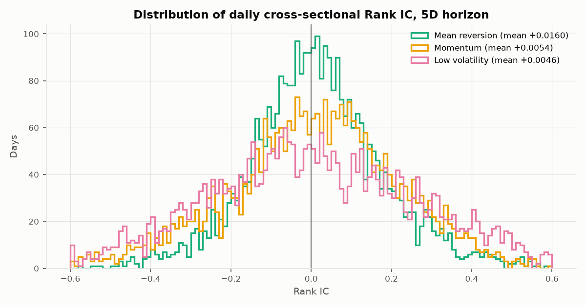

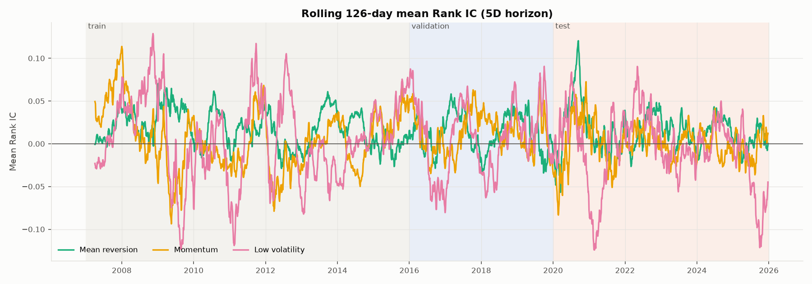

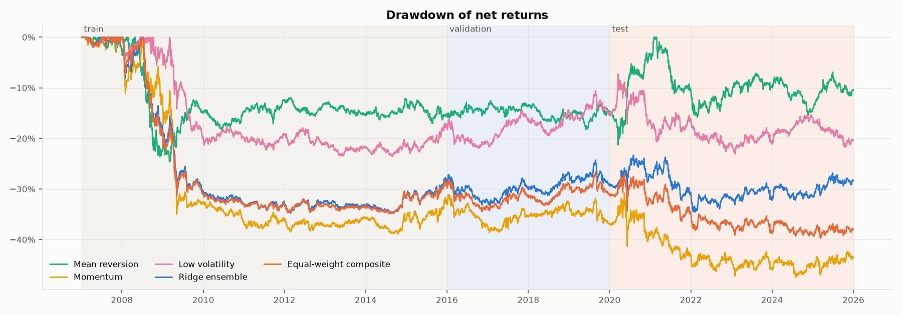

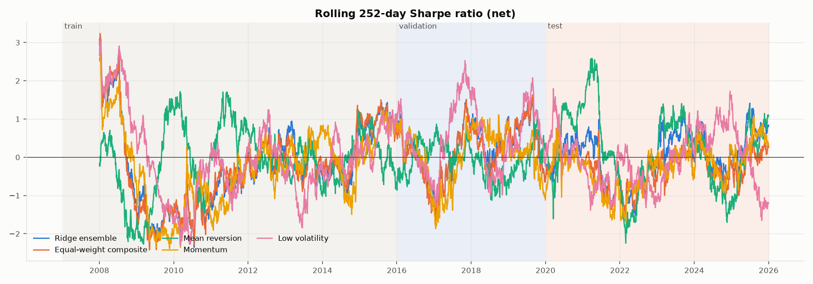

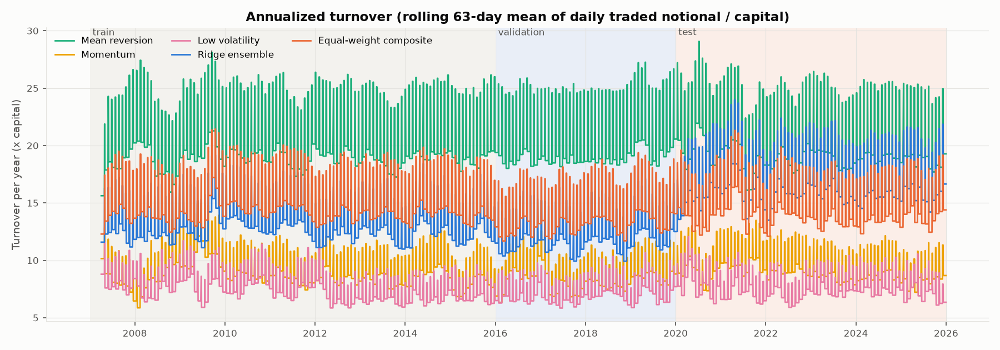

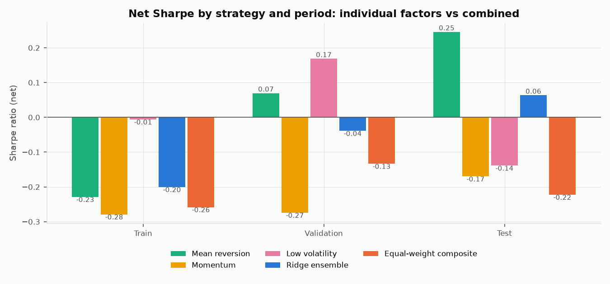

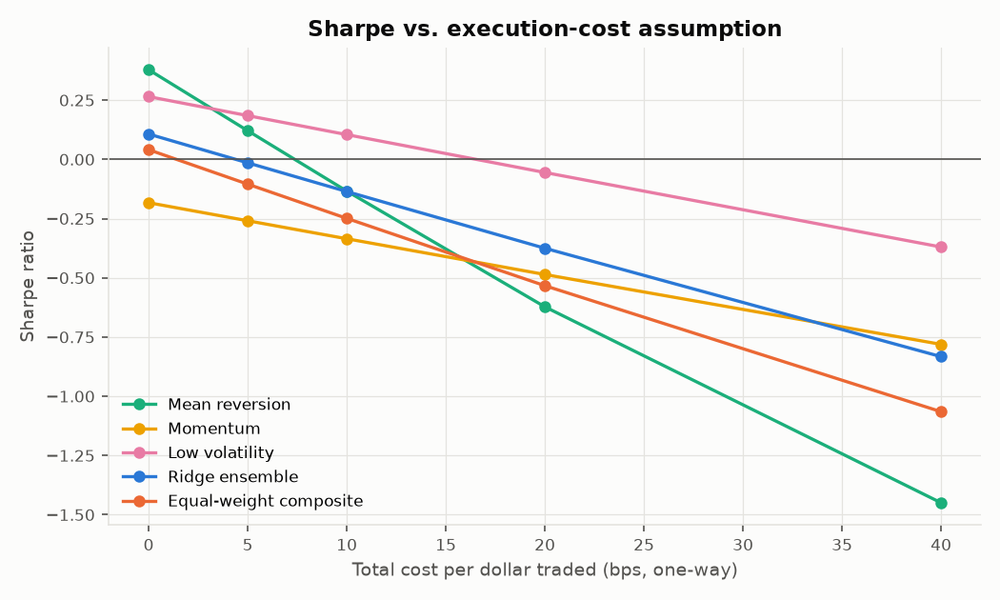

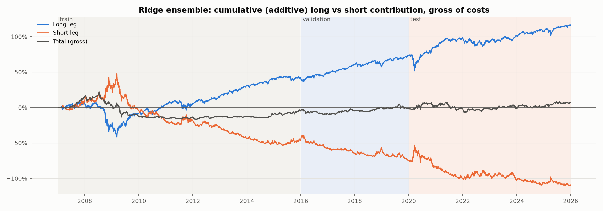

</details>
